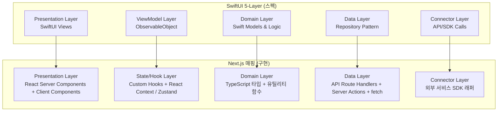
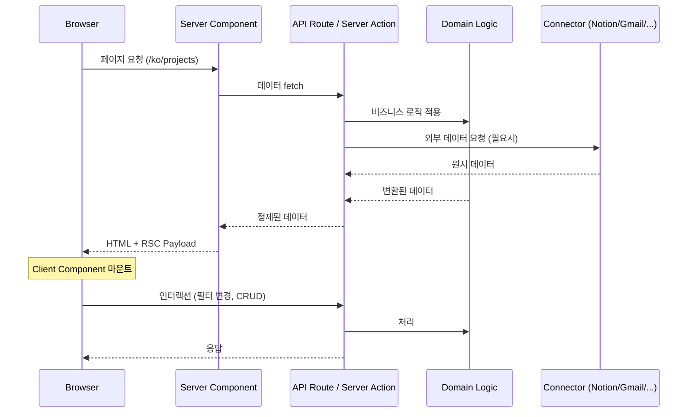
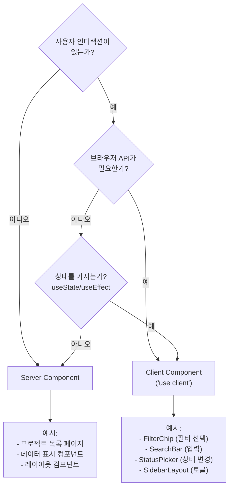
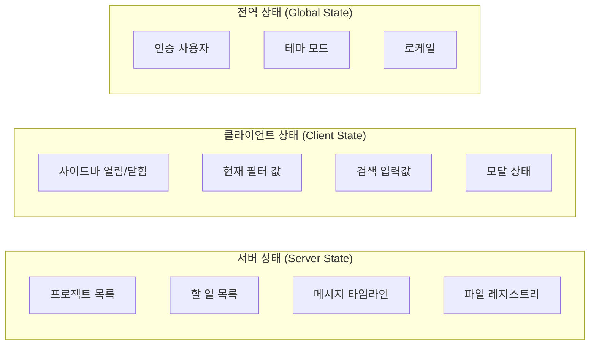
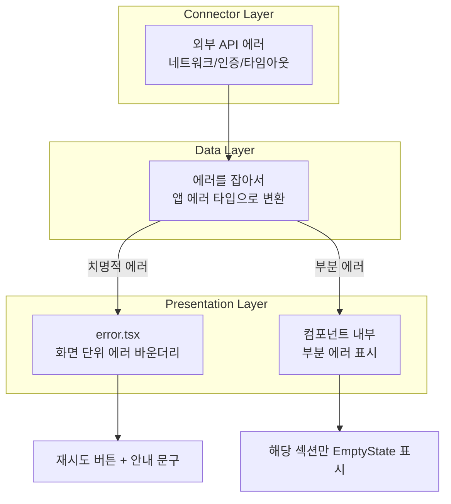
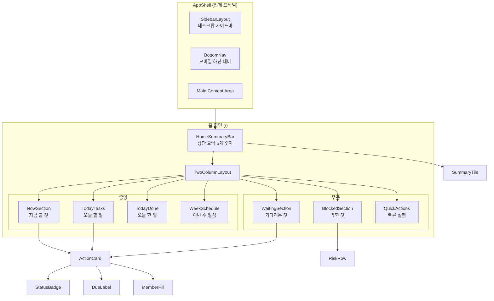

# Bitnaneun Studio OS -- 아키텍처 결정 문서

| 항목 | 내용 |
|------|------|
| **문서 ID** | ARCH-001 |
| **작성일** | 2026-03-16 |
| **작성자** | El Dibujante de Cajas (Architect) |
| **상태** | 초안 |
| **참조** | PRD-DEV-GUIDE-001, bitnaneun_studio_os_final_dev_spec.md |

---

## 1. 현재 프로젝트 구조 분석

### 1.1 기술 스택 현황

| 기술 | 버전 | 용도 |
|------|------|------|
| Next.js | 16.1.6 | App Router 기반 프레임워크 |
| React | 19.2.3 | UI 라이브러리 |
| Tailwind CSS | 4.x | 유틸리티 CSS (CSS 변수 기반 `@theme inline`) |
| next-intl | 4.8.3 | i18n (ko/en/ja 3개 언어) |
| framer-motion | 12.36.0 | 애니메이션 |
| TypeScript | 5.x | 타입 안전성 |

### 1.2 현재 파일 구조

```
src/
  app/
    layout.tsx                  # Root layout (children만 반환)
    page.tsx                    # Root redirect
    globals.css                 # CSS 변수 + Tailwind + 컴포넌트 클래스
    not-found.tsx
    [locale]/
      layout.tsx                # 폰트, i18n Provider, PageTransition
      page.tsx                  # 홈 = GalleryPage
      not-found.tsx
      about/page.tsx
      download/page.tsx
      journal/page.tsx
      journal/[slug]/page.tsx
      poster/[slug]/page.tsx
  components/
    ui/          PageTransition
    layout/      SentencePageFrame
    nav/         SentenceNav, SentenceBar, SentenceFooter, ContentSentenceNav, ContentSentenceFooter, sentenceUtils
    gallery/     GalleryPage, GalleryGrid, PosterArtwork, PosterStack, PosterCard, ListView, HomepageDesktopCollage, DownloadPage, DownloadSelector
    journal/     JournalPage, IssueCard, ArticleCard, ArticleView, ArticlePage
    poster/      PosterDetail, PosterDetailPage, RelatedWorks
    about/       AboutPage
  hooks/
    useNavSentence.ts
    useInfiniteScroll.ts
  lib/
    filters.ts
    galleryLayout.ts
    share.ts
    homeDesktopCollage.ts
    motion.ts
    mock/        journal.ts, posters.ts
    i18n/        config.ts, sentences.ts
  i18n/
    request.ts
  types/
    index.ts
  proxy.ts
```

### 1.3 현재 구조의 특징

**잘 된 부분:**
- CSS 변수로 디자인 토큰을 관리하고 있음 (`--color-bg`, `--space-sm` 등)
- i18n이 `[locale]` 라우팅으로 정상 세팅됨
- Server Components + Client Components 구분이 존재함
- 컴포넌트가 도메인별로 폴더 분류되어 있음

**Studio OS로 전환 시 고려사항:**
- 현재 타입은 포트폴리오 사이트용 (`Poster`, `Article`, `JournalIssue`)
- Studio OS의 15개 엔티티(`User`, `Project`, `Task` 등)는 완전히 새로운 도메인
- 현재 CSS 변수는 포트폴리오에 맞춰져 있으며, Studio OS의 상태 색상(`danger`, `warning`, `success` 등)이 없음
- 라우팅 구조가 포트폴리오 중심이므로 Studio OS 메뉴 9개에 맞게 재설계 필요

---

## 2. SwiftUI 5-Layer -> Next.js 매핑

스펙 문서(Section 18)는 SwiftUI 기반 5-Layer 구조를 권장한다. 이것을 Next.js + React 19 생태계에 맞게 재해석한다.

### 2.1 레이어 매핑 테이블



### 2.2 각 레이어 상세

#### Layer 1: Presentation (뷰)

| SwiftUI | Next.js |
|---------|---------|
| SwiftUI View | React Server Component (RSC) -- 기본 |
| `@State`, `@Binding` 뷰 | React Client Component (`'use client'`) -- 인터랙션 필요 시 |
| `NavigationStack` | App Router `[locale]/` 라우팅 |
| `TabView` | AppShell + 사이드바/하단 네비게이션 |

**결정:** Server Components를 기본으로 사용하고, 사용자 인터랙션이 있는 곳에서만 Client Components로 전환한다. 이유: RSC는 번들 크기를 줄이고 초기 로딩이 빠르다.

#### Layer 2: State/Hook (상태 관리)

| SwiftUI | Next.js |
|---------|---------|
| `ObservableObject` | Custom Hook (`useXxx`) |
| `@Published` | `useState` / `useReducer` |
| `@EnvironmentObject` | React Context 또는 Zustand store |

**결정:**
- **로컬 상태** -> `useState` / `useReducer` (컴포넌트 내부)
- **화면 단위 상태** -> Custom Hooks (예: `useTaskFilters`, `useProjectDetail`)
- **전역 상태** -> React Context (인증, 테마, 사이드바 등 소수)
- Zustand는 클라이언트 전역 상태가 복잡해질 때만 도입. v1에서는 Context로 충분.

#### Layer 3: Domain (도메인)

| SwiftUI | Next.js |
|---------|---------|
| Swift struct/enum | TypeScript `interface` / `type` / `enum` |
| 비즈니스 로직 함수 | 순수 함수 (`src/domain/`) |

**결정:** 도메인 로직은 React에 의존하지 않는 순수 TypeScript로 작성한다. 이렇게 하면 Server/Client 어디서든 사용 가능하고 테스트가 쉽다.

#### Layer 4: Data (데이터 접근)

| SwiftUI | Next.js |
|---------|---------|
| Repository Pattern | API Route Handlers (`app/api/`) |
| URLSession | `fetch` (Server Components에서 직접) |
| Core Data | 외부 DB (Supabase, PlanetScale 등 -- v1에서 결정) |

**결정:**
- Server Components에서 데이터를 직접 fetch하고 Props로 전달 (RSC 패턴).
- 뮤테이션은 Server Actions 또는 API Route Handlers.
- 개발 초기에는 Mock 데이터 (`src/lib/mock/`)를 사용하되, 같은 인터페이스로 추후 실 API로 교체 가능하게.

#### Layer 5: Connector (외부 연동)

| SwiftUI | Next.js |
|---------|---------|
| SDK 직접 호출 | Server-side SDK 래퍼 (`src/connectors/`) |

**결정:** 외부 서비스 연동은 반드시 서버 사이드에서만 실행. API 키가 클라이언트에 노출되지 않도록 한다. 각 서비스별 래퍼를 만들어 인터페이스를 통일.

### 2.3 데이터 흐름 다이어그램



---

## 3. 권장 폴더 구조

### 3.1 전체 구조

```
src/
  app/                              # --- App Router (라우팅만) ---
    layout.tsx                      # Root layout
    globals.css                     # 디자인 토큰 + Tailwind 설정
    [locale]/
      layout.tsx                    # i18n Provider + AppShell
      page.tsx                      # 홈 (운영 상황판)
      projects/
        page.tsx                    # 프로젝트 목록
        [id]/page.tsx               # 프로젝트 상세
      tasks/page.tsx                # 할 일
      communication/page.tsx        # 소통
      files/page.tsx                # 파일
      estimates/page.tsx            # 견적
        [id]/page.tsx               # 견적 상세
      team/page.tsx                 # 팀
      search/page.tsx               # 검색
      settings/page.tsx             # 설정
    api/                            # API Route Handlers
      projects/route.ts
      tasks/route.ts
      ...

  components/                       # --- UI 컴포넌트 ---
    layout/                         # 레이아웃 컴포넌트
      AppShell.tsx                  # 전체 앱 프레임 (사이드바 + 메인)
      SidebarLayout.tsx             # 데스크탑 사이드바
      BottomNav.tsx                 # 모바일 하단 네비게이션
      TwoColumnLayout.tsx           # 중앙 + 우측 2열 레이아웃
      SectionBlock.tsx              # 섹션 래퍼 (제목 + 내용)
      StickyActionBar.tsx           # 하단 고정 액션바

    information/                    # 정보 표시 컴포넌트
      SummaryTile.tsx               # 숫자 요약 타일
      ActionCard.tsx                # 행동 유도 카드
      TimelineItem.tsx              # 타임라인 항목
      StatusBadge.tsx               # 상태 뱃지
      CountBadge.tsx                # 숫자 뱃지
      MemberPill.tsx                # 멤버 태그
      DueLabel.tsx                  # 마감 표시
      RiskRow.tsx                   # 위험/막힌 일 행
      EmptyState.tsx                # 빈 상태

    input/                          # 입력 컴포넌트
      QuickActionButton.tsx         # 빠른 실행 버튼
      FilterChip.tsx                # 필터 칩
      SearchBar.tsx                 # 검색바
      AssigneePicker.tsx            # 담당자 선택
      StatusPicker.tsx              # 상태 선택
      PriorityPicker.tsx            # 우선순위 선택
      DateField.tsx                 # 날짜 입력
      SourceLinkButton.tsx          # 원본 링크 버튼

    features/                       # 화면별 조합 컴포넌트
      home/
        HomeSummaryBar.tsx          # 상단 요약
        NowSection.tsx              # 지금 볼 것
        TodayTasks.tsx              # 오늘 할 일
        WaitingSection.tsx          # 기다리는 것
        TodayDone.tsx               # 오늘 한 일
        WeekSchedule.tsx            # 이번 주 일정
        BlockedSection.tsx          # 막힌 것
        QuickActions.tsx            # 빠른 실행
      projects/
        ProjectList.tsx
        ProjectDetail.tsx
        ProjectSections.tsx
      tasks/
        TaskBoard.tsx
        TaskFilters.tsx
        TaskCard.tsx
      communication/
        MessageTimeline.tsx
        MessageCard.tsx
      files/
        FileRegistry.tsx
        FileCard.tsx
      estimates/
        EstimateList.tsx
        EstimateEditor.tsx
        EstimateVersionHistory.tsx
      team/
        TeamOverview.tsx
        MemberCard.tsx
      search/
        SearchResults.tsx

  domain/                           # --- 도메인 로직 (React 무의존) ---
    types/                          # TypeScript 타입 정의
      user.ts
      project.ts
      task.ts
      decision.ts
      message.ts
      file-asset.ts
      shipment.ts
      estimate.ts
      event.ts
      contact.ts
      presence.ts
      ai-insight.ts
      sync-job.ts
      enums.ts                      # 모든 상태값 enum
      common.ts                     # 공통 필드 (source_app 등)
      index.ts                      # barrel export
    utils/
      task-filters.ts               # 할 일 필터링 로직
      status-helpers.ts             # 상태 판별 함수
      date-helpers.ts               # 날짜 계산 (마감까지 남은 시간 등)
      risk-detection.ts             # 막힌 일 감지 로직
      home-aggregation.ts           # 홈 화면 데이터 집계

  hooks/                            # --- Custom Hooks ---
    useAuth.ts                      # 인증 상태
    useFilters.ts                   # 범용 필터 훅
    useTaskFilters.ts               # 할 일 필터
    useProjectDetail.ts             # 프로젝트 상세 데이터
    useSearch.ts                    # 검색
    usePresence.ts                  # 팀 상태
    useSidebar.ts                   # 사이드바 상태

  connectors/                       # --- 외부 서비스 래퍼 (서버 전용) ---
    notion/
      client.ts
      mappers.ts                    # Notion -> 내부 모델 변환
    google/
      calendar.ts
      drive.ts
      gmail.ts
    slack/
      client.ts
      mappers.ts

  lib/                              # --- 유틸리티 ---
    api-client.ts                   # fetch 래퍼
    mock/                           # 개발용 Mock 데이터
      projects.ts
      tasks.ts
      messages.ts
      ...
    i18n/
      config.ts
      messages/
        ko.json
        en.json
        ja.json

  styles/                           # --- 스킨/테마 ---
    tokens.css                      # 디자인 토큰 (globals.css에서 import)
    skins/
      light.css                     # 라이트 모드 토큰 값
      dark.css                      # 다크 모드 토큰 값

  i18n/
    request.ts                      # next-intl 설정
```

### 3.2 폴더 분류 원칙

| 폴더 | 원칙 | 무엇이 들어가나 |
|------|------|----------------|
| `app/` | **라우팅만.** 비즈니스 로직 금지. | `page.tsx`, `layout.tsx`, `loading.tsx`, `error.tsx` |
| `components/layout/` | 화면 뼈대. 데이터 없음. | AppShell, SidebarLayout, SectionBlock 등 |
| `components/information/` | 데이터를 **읽기 전용**으로 표시. | ActionCard, StatusBadge, SummaryTile 등 |
| `components/input/` | 사용자 **입력**을 받는 것. | FilterChip, SearchBar, Pickers 등 |
| `components/features/` | 특정 화면을 위한 **조합** 컴포넌트. | HomeSummaryBar, ProjectDetail 등 |
| `domain/` | React 없는 **순수 TypeScript**. | 타입, enum, 비즈니스 함수 |
| `hooks/` | 상태 로직을 캡슐화. | useTaskFilters, useAuth 등 |
| `connectors/` | 외부 서비스 통신. **서버 전용**. | Notion, Gmail, Calendar SDK 래퍼 |
| `lib/` | 범용 유틸리티. | fetch 래퍼, mock 데이터, i18n 메시지 |
| `styles/` | 시각 표현만. | 토큰 CSS, 스킨 파일 |

### 3.3 네이밍 컨벤션

| 대상 | 규칙 | 예시 |
|------|------|------|
| 컴포넌트 파일 | PascalCase | `ActionCard.tsx` |
| 컴포넌트 이름 | 의미 기반 PascalCase | `StatusBadge`, `SummaryTile` |
| Hook 파일 | camelCase, `use` 접두사 | `useTaskFilters.ts` |
| 도메인 타입 파일 | kebab-case | `file-asset.ts` |
| 유틸리티 파일 | kebab-case | `date-helpers.ts` |
| CSS 변수 | `--카테고리-항목` | `--color-status-danger` |
| enum 값 | snake_case | `waiting_client` |

---

## 4. 컴포넌트 설계 패턴

### 4.1 의미 기반 컴포넌트 원칙

컴포넌트 이름은 **시각적 형태가 아니라 역할**을 나타낸다.

```
(나쁨) RedCard, BigButton, ThreeColumnGrid
(좋음) ActionCard, QuickActionButton, TwoColumnLayout
```

이유: 디자인이 바뀌어도 컴포넌트 이름과 역할은 유지된다. "ActionCard"는 카드형이든 리스트형이든 "행동을 유도하는 정보 단위"라는 의미는 변하지 않는다.

### 4.2 스킨 분리 패턴

모든 의미 컴포넌트는 **로직**과 **스타일**을 분리한다.

```
컴포넌트 = 데이터 바인딩(Props) + 구조(JSX) + 스타일(CSS 변수/Tailwind)
```

**스타일 분리 규칙:**

1. **색상**: CSS 변수로만 참조. 직접 색상값 금지.
   ```tsx
   // 금지
   <div className="bg-red-500 text-white">

   // 허용
   <div className="bg-[var(--color-status-danger)] text-[var(--color-text-on-danger)]">

   // 권장 (Tailwind 확장 후)
   <div className="bg-status-danger text-on-danger">
   ```

2. **간격**: 토큰 변수 사용.
   ```tsx
   // 금지
   <div className="p-4 gap-6">

   // 허용
   <div className="p-[var(--space-md)] gap-[var(--space-lg)]">
   ```

3. **둥근 모서리, 그림자**: 토큰 사용.
   ```tsx
   <div className="rounded-[var(--radius-md)] shadow-[var(--shadow-card)]">
   ```

### 4.3 Server Component vs Client Component 결정 기준



**원칙:** 기본은 Server Component. `'use client'`는 필요할 때만.

### 4.4 컴포넌트 Props 설계

```tsx
// 나쁨: 원시 데이터를 직접 전달
interface ActionCardProps {
  messageId: string;
  senderEmail: string;
  bodyText: string;
  sentAt: string;
  needsReply: boolean;
}

// 좋음: 의미 단위로 정제된 Props
interface ActionCardProps {
  action: string;           // "답장 보내기"
  sender: string;           // "김디자이너"
  description: string;      // "A5로 바꾸기 - 국제시장2"
  timestamp: string;        // "2시간 전"
  status: 'danger' | 'warning' | 'info';
  onAction?: () => void;
}
```

**이유:** 컴포넌트가 데이터 소스를 몰라야 디자인 교체가 쉽다. 데이터 -> 의미 Props 변환은 `domain/utils/`에서 한다.

---

## 5. 상태 관리 방안

### 5.1 상태 분류



### 5.2 기술 선택

| 상태 유형 | 기술 | 이유 |
|----------|------|------|
| 서버 상태 | RSC `fetch` + `Suspense` | Next.js 16 기본. 캐싱과 스트리밍 활용. |
| 클라이언트 뮤테이션 | Server Actions | 폼 제출, 상태 변경. 클라이언트 코드 최소화. |
| 로컬 UI 상태 | `useState` | 모달, 드롭다운, 입력값 등. |
| 화면 단위 상태 | Custom Hooks | 필터 조합, 정렬 등 화면별 로직 캡슐화. |
| 전역 UI 상태 | React Context | 인증, 테마, 사이드바. 간단하고 충분. |

**Zustand는 v1에서 도입하지 않는다.** React Context + Server Components 조합으로 대부분의 상태 관리가 커버된다. 전역 클라이언트 상태가 5개 이상으로 복잡해지면 그때 도입을 검토한다.

---

## 6. 디자인 토큰 -- Tailwind CSS 4 구현

### 6.1 토큰 구조

현재 `globals.css`에 CSS 변수가 이미 일부 정의되어 있다. Studio OS에서는 이를 확장한다.

```css
/* src/styles/tokens.css */

:root {
  /* ── 배경 ── */
  --color-bg-primary: #ffffff;
  --color-bg-secondary: #f7f7f8;
  --color-bg-tertiary: #efefef;

  /* ── 텍스트 ── */
  --color-text-primary: #070707;
  --color-text-secondary: #5f5f5f;
  --color-text-muted: #9a9a9a;
  --color-text-inverse: #ffffff;

  /* ── 상태 색상 (의미 기반) ── */
  --color-status-danger: #dc2626;
  --color-status-warning: #f59e0b;
  --color-status-info: #3b82f6;
  --color-status-success: #16a34a;
  --color-status-accent: #070707;

  /* ── 상태 배경 (연한 버전) ── */
  --color-status-danger-bg: #fef2f2;
  --color-status-warning-bg: #fffbeb;
  --color-status-info-bg: #eff6ff;
  --color-status-success-bg: #f0fdf4;

  /* ── 보더 ── */
  --color-border-default: #e5e5e5;
  --color-border-strong: #d4d4d4;

  /* ── 간격 ── */
  --space-xs: 0.25rem;    /* 4px */
  --space-sm: 0.5rem;     /* 8px */
  --space-md: 1rem;       /* 16px */
  --space-lg: 1.5rem;     /* 24px */
  --space-xl: 2rem;       /* 32px */
  --space-2xl: 3rem;      /* 48px */

  /* ── 둥근 모서리 ── */
  --radius-sm: 4px;
  --radius-md: 8px;
  --radius-lg: 12px;
  --radius-full: 9999px;

  /* ── 그림자 ── */
  --shadow-card: 0 1px 3px rgba(0, 0, 0, 0.08);
  --shadow-card-hover: 0 4px 12px rgba(0, 0, 0, 0.12);
  --shadow-modal: 0 8px 32px rgba(0, 0, 0, 0.16);

  /* ── 타이포그래피 ── */
  --font-size-title: 1.25rem;
  --font-size-body: 0.9375rem;
  --font-size-caption: 0.8125rem;
  --font-size-small: 0.75rem;
  --font-weight-normal: 400;
  --font-weight-medium: 500;
  --font-weight-bold: 700;
  --line-height-tight: 1.25;
  --line-height-normal: 1.5;
}
```

### 6.2 다크 모드

```css
/* src/styles/skins/dark.css */

[data-theme='dark'] {
  --color-bg-primary: #0a0a0a;
  --color-bg-secondary: #171717;
  --color-bg-tertiary: #262626;

  --color-text-primary: #fafafa;
  --color-text-secondary: #a3a3a3;
  --color-text-muted: #737373;
  --color-text-inverse: #0a0a0a;

  --color-status-danger: #f87171;
  --color-status-warning: #fbbf24;
  --color-status-info: #60a5fa;
  --color-status-success: #4ade80;

  --color-status-danger-bg: #450a0a;
  --color-status-warning-bg: #451a03;
  --color-status-info-bg: #172554;
  --color-status-success-bg: #052e16;

  --color-border-default: #2e2e2e;
  --color-border-strong: #404040;

  --shadow-card: 0 1px 3px rgba(0, 0, 0, 0.3);
  --shadow-card-hover: 0 4px 12px rgba(0, 0, 0, 0.4);
  --shadow-modal: 0 8px 32px rgba(0, 0, 0, 0.5);
}
```

### 6.3 Tailwind CSS 4에서 토큰 통합

Tailwind CSS 4는 `@theme` 디렉티브로 CSS 변수를 Tailwind 유틸리티와 연결한다.

```css
/* globals.css */
@import "tailwindcss";
@import "../styles/tokens.css";
@import "../styles/skins/dark.css";

@theme inline {
  /* 배경 */
  --color-bg-primary: var(--color-bg-primary);
  --color-bg-secondary: var(--color-bg-secondary);

  /* 텍스트 */
  --color-text-primary: var(--color-text-primary);
  --color-text-secondary: var(--color-text-secondary);

  /* 상태 */
  --color-status-danger: var(--color-status-danger);
  --color-status-warning: var(--color-status-warning);
  --color-status-info: var(--color-status-info);
  --color-status-success: var(--color-status-success);

  /* 간격 */
  --spacing-xs: var(--space-xs);
  --spacing-sm: var(--space-sm);
  --spacing-md: var(--space-md);
  --spacing-lg: var(--space-lg);
  --spacing-xl: var(--space-xl);

  /* 둥근 모서리 */
  --radius-sm: var(--radius-sm);
  --radius-md: var(--radius-md);
  --radius-lg: var(--radius-lg);
}
```

### 6.4 토큰 -> Tailwind 클래스 매핑 테이블

| 토큰 | Tailwind 클래스 | 용도 |
|------|----------------|------|
| `--color-bg-primary` | `bg-bg-primary` | 기본 배경 |
| `--color-bg-secondary` | `bg-bg-secondary` | 카드, 섹션 배경 |
| `--color-text-primary` | `text-text-primary` | 기본 텍스트 |
| `--color-text-secondary` | `text-text-secondary` | 보조 텍스트 |
| `--color-status-danger` | `text-status-danger`, `bg-status-danger` | 급함, 위험 |
| `--color-status-warning` | `text-status-warning`, `bg-status-warning` | 확인 필요, 대기 |
| `--color-status-info` | `text-status-info`, `bg-status-info` | 일반 정보 |
| `--color-status-success` | `text-status-success`, `bg-status-success` | 완료, 정상 |
| `--space-sm` | `p-spacing-sm`, `gap-spacing-sm` | 작은 간격 |
| `--space-md` | `p-spacing-md`, `gap-spacing-md` | 기본 간격 |
| `--radius-md` | `rounded-md` | 기본 둥근 모서리 |
| `--shadow-card` | `shadow-[var(--shadow-card)]` | 카드 그림자 |

### 6.5 토큰 확장 규칙

새로운 토큰이 필요할 때:

1. 기존 토큰으로 표현 가능한지 먼저 확인한다.
2. 새 토큰이 필요하면 같은 네이밍 패턴을 따른다: `--카테고리-세부-변형`
3. 라이트 모드와 다크 모드 모두에 값을 정의한다.
4. `@theme inline`에 등록하여 Tailwind에서 사용 가능하게 한다.

```
예시: 새로운 "accent-subtle" 색상이 필요하면
  --color-status-accent-subtle  (라이트: #f5f5f5, 다크: #262626)
```

---

## 7. 라우팅 구조

### 7.1 Studio OS 라우팅

```
/[locale]/                    # 홈 (운영 상황판)
/[locale]/projects            # 프로젝트 목록
/[locale]/projects/[id]       # 프로젝트 상세
/[locale]/tasks               # 할 일
/[locale]/communication       # 소통
/[locale]/files               # 파일
/[locale]/estimates           # 견적
/[locale]/estimates/[id]      # 견적 상세
/[locale]/team                # 팀
/[locale]/search              # 검색
/[locale]/settings            # 설정
```

### 7.2 메뉴 <-> 라우트 매핑

| 메뉴 | 라우트 | 데스크탑 | 모바일 |
|------|--------|---------|--------|
| 홈 | `/` | 사이드바 | 하단 네비 |
| 프로젝트 | `/projects` | 사이드바 | 하단 네비 |
| 할 일 | `/tasks` | 사이드바 | 하단 네비 |
| 소통 | `/communication` | 사이드바 | 더보기 안 |
| 파일 | `/files` | 사이드바 | 하단 네비 |
| 견적 | `/estimates` | 사이드바 | 더보기 안 |
| 팀 | `/team` | 사이드바 | 더보기 안 |
| 검색 | `/search` | 상단 공통 | 상단 공통 |
| 설정 | `/settings` | 사이드바 | 더보기 안 |

---

## 8. 에러 전파 전략



**원칙:**
- 하나의 외부 서비스 장애가 전체 화면을 깨뜨리지 않는다.
- 홈 화면은 8개 섹션이 독립적으로 로딩/에러 처리된다.
- 사용자에게는 기술적 메시지 대신 행동 가능한 안내를 보여준다 ("다시 시도" 버튼).

---

## 9. ADR 요약

이 문서에서 내린 주요 결정을 ADR 형식으로 정리한다.

### ADR-001: Server Components를 기본으로 사용

- **컨텍스트:** Next.js 16 + React 19 환경. 초기 로딩 성능이 중요 (홈 2초 목표).
- **결정:** 모든 컴포넌트는 Server Component가 기본. `'use client'`는 인터랙션이 필요한 곳에만.
- **이유:** 번들 크기 감소, 서버에서 데이터 fetch 가능, 초기 로딩 최적화.
- **결과:** 클라이언트 상태 관리가 간소화됨. 인터랙티브 컴포넌트 경계를 명확히 정의해야 함.

### ADR-002: v1에서 Zustand 미도입, React Context 사용

- **컨텍스트:** 전역 상태 관리 라이브러리 선택 필요.
- **선택지:** (A) Zustand, (B) React Context, (C) Jotai
- **결정:** React Context 사용.
- **이유:** 전역 클라이언트 상태가 3~4개 (인증, 테마, 사이드바)로 단순. 외부 의존성 불필요.
- **결과:** 상태가 복잡해지면 Zustand로 마이그레이션 가능. Context는 자연스럽게 래핑됨.

### ADR-003: 디자인 토큰은 CSS 변수 + Tailwind @theme로 관리

- **컨텍스트:** 디자인 교체 가능 구조가 핵심 원칙. Tailwind CSS 4 사용 중.
- **선택지:** (A) CSS 변수 + @theme, (B) Tailwind config JS, (C) CSS-in-JS
- **결정:** CSS 변수를 단일 진실의 원천으로 하고, `@theme inline`으로 Tailwind와 연결.
- **이유:** 테마 전환이 CSS 변수 값 변경만으로 가능. JS 빌드 불필요. 다크 모드가 CSS만으로 동작.
- **결과:** 하드코딩 색상/간격 사용을 리뷰에서 차단해야 함.

### ADR-004: 도메인 로직은 React 무의존 순수 TypeScript

- **컨텍스트:** 스펙의 "디자인 교체 시 기능 코드 수정 없어야 함" 원칙.
- **결정:** `src/domain/`에 React import 없는 순수 TS 함수/타입만 둔다.
- **이유:** 테스트 용이, Server/Client 양쪽에서 사용 가능, UI 프레임워크 독립.
- **결과:** 컴포넌트 Props 변환 계층이 필요함 (domain 데이터 -> 의미 Props).

### ADR-005: 외부 서비스 연동은 서버 전용

- **컨텍스트:** Notion, Gmail, Calendar, Drive, Slack 5개 외부 서비스 연동.
- **결정:** 모든 connector는 서버 사이드에서만 실행. API Route Handler 또는 Server Action을 통해 접근.
- **이유:** API 키 보안. 클라이언트 번들에 SDK 포함 방지. CORS 문제 회피.
- **결과:** 클라이언트에서 외부 데이터가 필요하면 반드시 자체 API를 경유.

### ADR-006: 컴포넌트는 의미 기반 이름 사용

- **컨텍스트:** 스펙 Section 18에서 의미 기반 컴포넌트 목록 제시 (ActionCard, StatusBadge 등).
- **결정:** 스펙의 컴포넌트 이름 체계를 그대로 따른다.
- **이유:** 스펙과 구현의 용어 통일. 디자인이 바뀌어도 역할 기반 이름은 유지.
- **결과:** 개발자가 컴포넌트 역할을 이름만으로 파악 가능.

---

## 10. 핵심 컴포넌트 관계 다이어그램



---

## 11. 결론

이 문서는 Bitnaneun Studio OS의 기술 아키텍처를 정의한다.

**핵심 결정 3가지:**

1. **SwiftUI 5-Layer를 Next.js에 매핑:** Presentation(RSC/CC) - Hooks - Domain(순수 TS) - Data(API Routes) - Connectors(서버 전용)
2. **디자인 교체 가능 구조:** CSS 변수 토큰 -> Tailwind @theme -> 의미 기반 컴포넌트. 스킨 파일만 바꾸면 테마 전환.
3. **서버 우선 아키텍처:** Server Components 기본, 클라이언트 최소화, 외부 연동 서버 전용.

이 설계를 기반으로 개발 가이드 문서(Part 2, Part 3)를 작성할 수 있다.

---

**VEREDICTO: 초안 -- 사용자 검토 대기**

**요약:** SwiftUI 5-Layer를 Next.js 생태계에 매핑하고, 폴더 구조, 컴포넌트 설계 패턴, 디자인 토큰 구현 방법, 상태 관리 방안을 결정했다. 6개 ADR 포함.

**차단 사항:** 없음

**보류 조건:** 사용자의 아키텍처 결정 승인

**다음 액션:** 사용자가 이 문서를 검토하고 승인하면, 개발 가이드 문서 작성에 착수한다.
